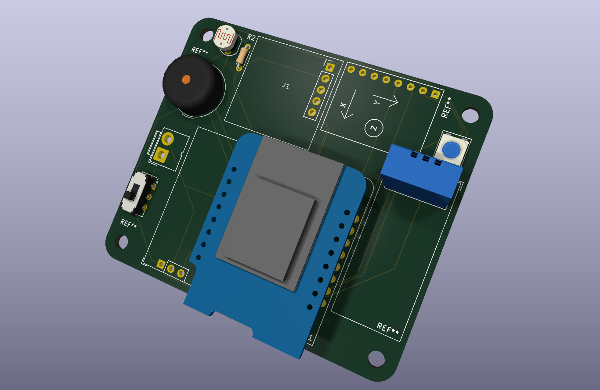
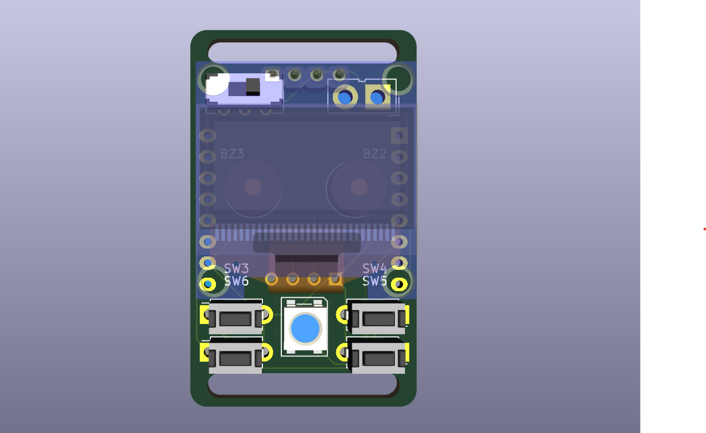
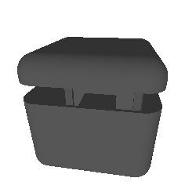
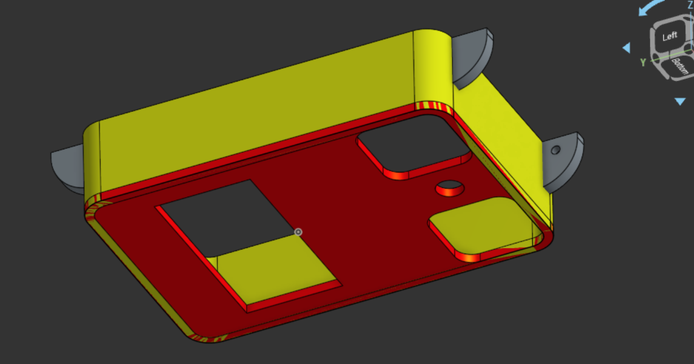
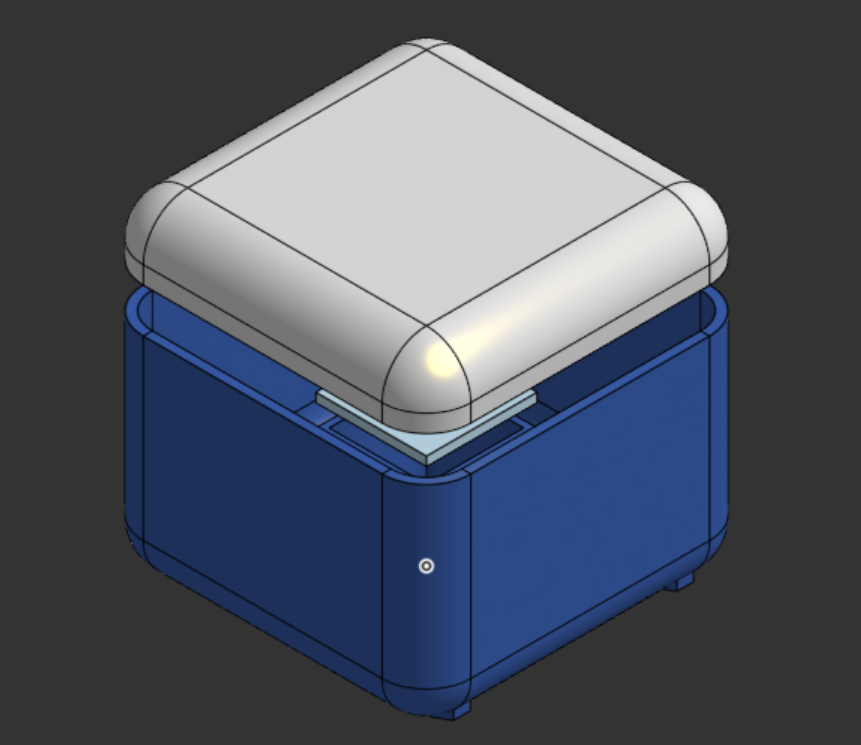
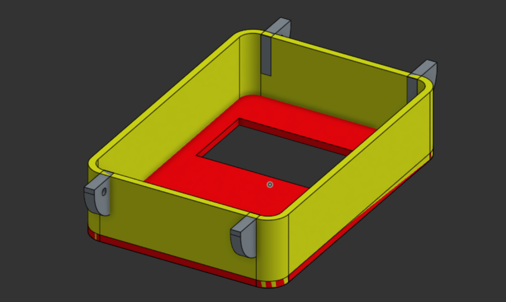
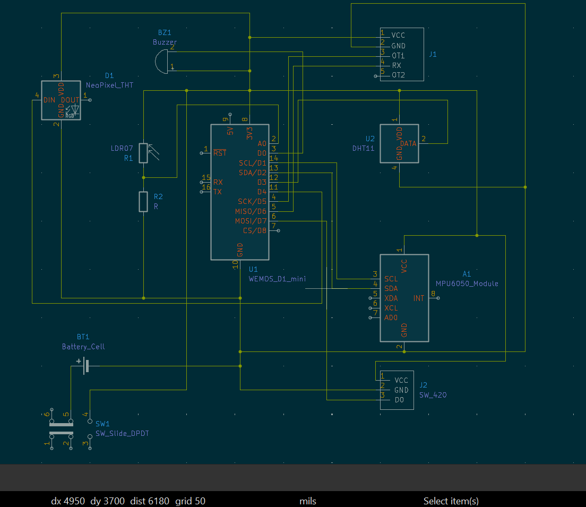
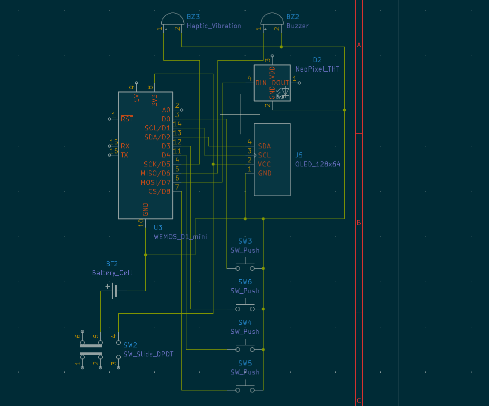

# S3 MK-1

A compact Surveillance Security System built around a sensor-equipped cube and a wearable controller.

The S3 Cube monitors its surroundings using multiple sensors for motion, vibration, orientation, light, temperature, humidity, and sound. The data is sent to the S3 Watch, a small wearable controller with an OLED display and physical buttons for monitoring and controlling the cube.

The project includes custom PCBs designed in KiCad, custom component footprints, ESP8266 firmware, and fully 3D-printed enclosures designed in Onshape.

| S3 MK-1 Cube | S3 MK-1 Watch |
|-----------|------------|
|  |  |

# Features

- Wireless S3 Cube MK-1 to S3 Watch MK-1 communication
- Motion / Presence detection
- Vibration detection
- Tilt / Orientation detection
- Sound detection
- Light detection
- Temperature & Humidity monitoring
- OLED display
- Physical button controls
- Arm / Disarm system
- Status indication
- Custom KiCad PCBs
- Custom KiCad footprints
- ESP8266 firmware
- 3D-printed enclosures
- Weighted self-orienting cube design
- 20mm watch strap support

## CAD

> **Note:**
> S3 Cube MK-1 enclosure is made for rolling in a plain surface. This's the reason the edges are with R10.

| S3 Cube MK-1 | S3 Watch MK-1 |
|------|-------|
|  |  |
|  |  |

## PCB

> **Note:**  
> The S3 Watch PCB is designed with a 20mm strap support, If you are 3D printing the enclosure for the watch, Feel free to break it with pliers.

| S3 MK-1 Cube PCB | S3 MK-1 Watch PCB |
|-----------|------------|
|  |  |
|  |  |

## Schematic

> **Note:**  
> The preview images may be scaled down and lose detail. Use the journal.md for a clear, full-resolution view.

| S3 MK-1 Cube | S3 MK-1 Watch |
|-----------|------------|
|  |  |

## BOM

I will add this once after I gather all the links for components :)